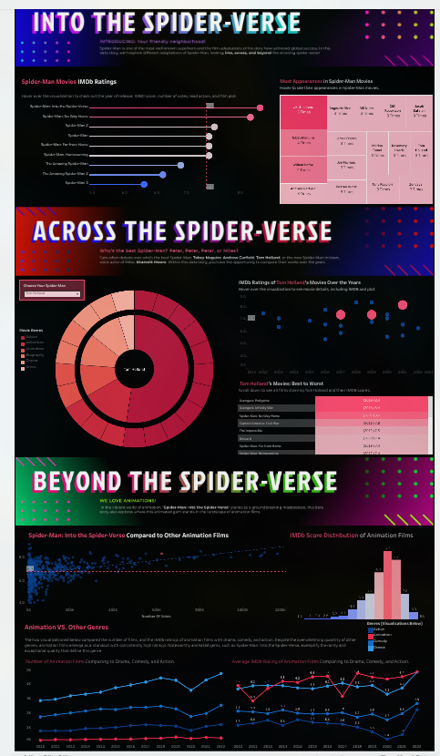
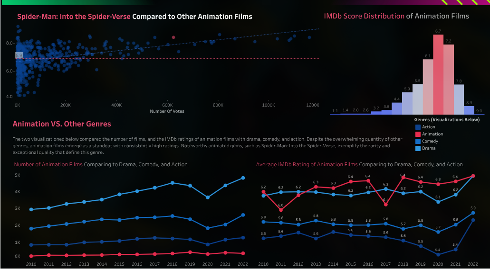
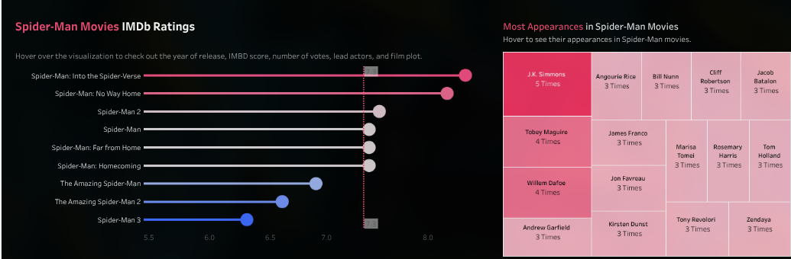

# Spider-Man Movie Visualization Dashboard

## Visualization Source

**Visualization link:** https://public.tableau.com/app/profile/xinran.peng/viz/DataPlusMoviesStarterDashboard_17016561962340/Dashboard1

## Overview Screenshot

---

## Purpose of the Visualization

The purpose of this visualization is to help Spider-Man fans explore and compare different Spider-Man movies. It allows users to look at movie performance, IMDb ratings, box office results, genres, actors, and comparisons between *Into the Spider-Verse* and other animated or superhero films.

The dashboard is useful for casual exploration, but it can also support arguments or discussions among fans, such as deciding which Spider-Man movie performed best, which actor appeared in the strongest films, or how *Into the Spider-Verse* compares to other animated movies.

---

## What Is the Data?

The data used in this visualization appears to be IMDb movie data. It includes information such as:

* Movie titles
* IMDb ratings
* Release years
* Genres
* Actors
* Box office performance
* Movie popularity or ranking information

Because the dashboard focuses on Spider-Man movies and related genre comparisons, the dataset likely includes both Spider-Man films and other movies in similar categories, especially superhero and animated films.

---

## How Was the Data Captured or Collected?

The data was most likely collected from IMDb, possibly through the IMDb API or another movie database source. IMDb data is commonly used for visualizations because it provides structured information about movies, ratings, actors, genres, and release details.

However, the dashboard does not appear to clearly explain the exact data collection method. A stronger version of this visualization would include a short data source note explaining where the data came from, when it was collected, and whether the box office and rating values are current or historical.

---

## Intended Users

The main users of this visualization are Spider-Man fans and movie fans. The dashboard is especially useful for people who want to compare different Spider-Man films or support a debate about which Spider-Man movie, actor, or franchise era is the best.

The visualization is most likely designed for the general public rather than experts. Users do not need advanced data analysis skills to understand the dashboard. It is made for casual exploration, fan discussion, and quick comparison.

Possible users include:

* Spider-Man fans
* Marvel fans
* Movie fans
* Fans discussing whether *Into the Spider-Verse* outperformed similar animated movies

---

## Questions and Insights

This visualization allows users to ask and answer several types of questions about Spider-Man movies and related films.

### Question 1: How did *Into the Spider-Verse* perform against other animated movies?

Users can filter the dashboard by genre or movie type to compare *Into the Spider-Verse* with other animated films.

---

### Question 2: Which Spider-Man actor appeared in which movies?

The dashboard can help users explore connections between actors and movies. This is useful for comparing actors such as Tobey Maguire, Andrew Garfield, Tom Holland, and voice actors from the Spider-Verse films.

---

## Visual and Interaction Design Discussion

The visual design is one of the strongest parts of the dashboard. The color choices match the *Into the Spider-Verse* aesthetic, using bright, energetic colors that feel connected to the comic-book and animated style of the film. This makes the dashboard visually exciting and appropriate for the topic.

The dashboard is also easy to use overall. The charts and filters allow users to explore the data without needing technical knowledge. The interface supports casual comparison, which fits the intended audience of Spider-Man fans and general movie viewers.

However, some design choices could be improved. The main graph can feel crowded, especially when many movies or categories are displayed at once. A more minimal layout could make the data easier to read. 

A better version of the dashboard could improve the design by:
* Reducing clutter in the main chart
* Adding clearer labels and legends
* Using tooltips to explain values when users hover over charts
* Providing a reset button for filters
* Separating major views into tabs, such as Ratings, Box Office, Actors, and Genre Comparison

---

## Limitations of the Design

Although the visualization is useful, it has several limitations.

First, the dashboard depends heavily on IMDb data, which may not tell the full story of a movie's success. IMDb ratings are based on user reviews and may be affected by fan behavior, popularity, or review bias. Box office performance also depends on release timing, marketing, budget, and international availability.

Second, the visualization does not clearly explain where the data came from or when it was collected. This makes it harder for users to know whether the information is current.

---

