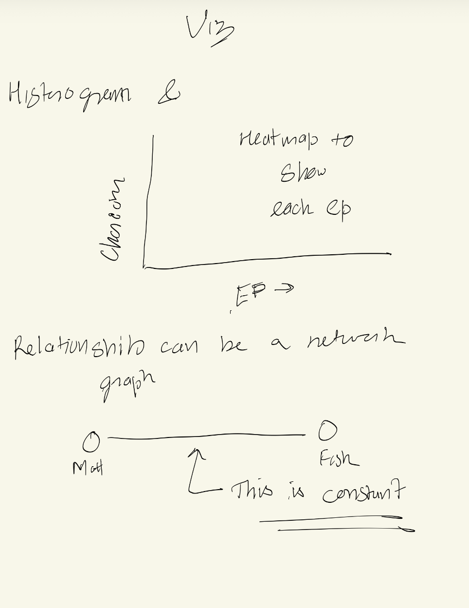
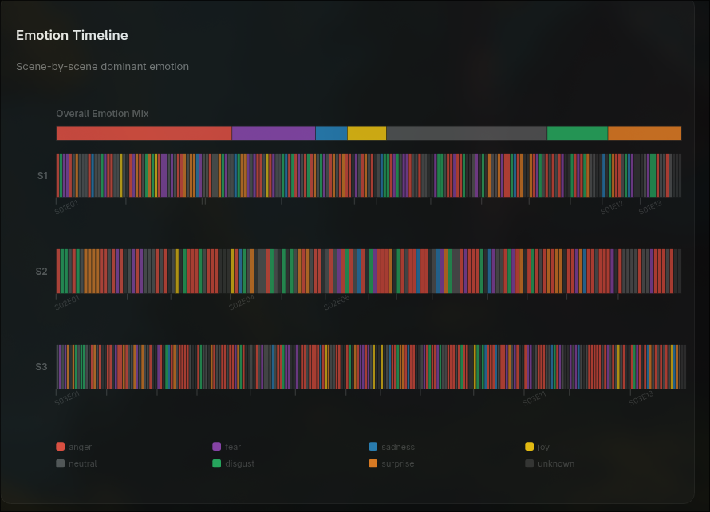

# Daredevil Character Intelligence Dashboard

## Motivation

The motivation behind this application is to analyse the characters from one of my favourite shows Daredevil and see data points in much more visual way. 
One of the most important questions, is how are the character related with each other. 


## Data

### Data source

- **Primary source:** Daredevil episode transcripts (`.txt`) collected in `project3/data/daredevil_txt/`
- **Transcript:** https://transcripts.foreverdreaming.org/app.php/anubis/api/make_challenge?redir=https%3A%2F%2Ftranscripts.foreverdreaming.org%2Fviewforum.php%3Ff%3D1255 
- **NOTE:** Claude (LLM) was used to clean up the transcripts and assign the speakers and location. I manually check random episodes to make sure the transcripts are accuarte which they were. 
  
### Data description

The final data model has two levels:

1. **Line-level data (`line_data.csv`)**
   - Episode code and season
   - Scene ID
   - Location
   - Raw and normalized speaker names
   - Dialogue line text
   - Conversation turn index

2. **Scene-level data (`scene_data.csv`)**
   - Episode code and season
   - Scene ID
   - Location
   - Aggregated scene text
   - Dominant emotion
   - Full emotion score distribution (JSON)

### Data processing methods

Data processing is implemented in:

- `project3/data/main.py`

Processing pipeline summary:

1. Parse transcript filenames into season/episode identifiers (`S01E01` format).
2. Detect and segment scenes using location markers.
3. Extract speaker-line pairs with regex-based parsing.
4. Clean dialogue text (remove stage directions and normalize spacing).
5. Normalize speaker naming variants.
6. Use a hugging face model for emotional analysis 

To process the data, you can run the main.py code and the output will generate 

- `line_data.csv`
- `scene_data.csv`


## Visualization Components and Interaction Design

The interface is structured as a single-page, multi-section dashboard. Core controls are global and coordinated across views.

### Global controls

- **Season buttons:** All, S1, S2, S3
- **Episode slider:** switch from full-season context to specific episode
- **Character selector:** focus on one character vs all characters
- **Identity mode toggle:** Lawyer vs Vigilante framing for select views

### Interaction behavior and linked updates

- Season and episode filters update nearly all charts simultaneously.
- Character filtering narrows dialogue, phrase, trend, and thematic views.
- Clicking chart elements (e.g., bars or network nodes) writes back to the same shared state.
- Tooltips provide context-sensitive details (counts, emotions, location, etc.).


## Design Sketches and Design Justifications

### Design sketches


 - 
PS: My handwriting is terrrible which is why I prefer typing but my sketches was mainly for the heatmap because I wanted to use one but I was trying to think how I could use one 

### Design justifications

- **Layout:** The overall layout was done level by level so it is easier to grade and follow the overall website
- **Colors:** The colors were chooses because it is the colors of the characters 


## What the Application Enables You to Discover

This dashboard enabled several concrete findings from transcript-derived evidence:

1. **Shifts in centrality:** Character prominence changes by season and by selected episode.
2. **Relationship evolution:** Network playback highlights when key character ties emerge and intensify.
3. **Emotional Thene:** It shows the emotional theme breakdown scene by scene for every episode 




## Process, Tech Stack, and Code Structure

### Libraries and tools used

- **Frontend:** HTML, CSS, JavaScript
- **Visualization:** D3.js
- **Geospatial view:** Leaflet.js
- **Data processing:** Python, pandas, tqdm
- **NLP emotion inference:** Hugging Face Transformers + PyTorch

### Code structure

- `project3/index.html` — page structure and visualization containers
- `project3/styles.css` — dashboard styling and layout
- `project3/const.js` — constants, color maps, canonical names, app state
- `project3/script.js` — data loading, filtering, rendering, interactions
- `project3/data/main.py` — transcript parsing + emotion processing pipeline
- `project3/data/*.csv` — generated datasets consumed by frontend

### How to run the application

From `project3`, use any static server (recommended):

```bash
python -m http.server 8000
```

Open:

- `http://localhost:8000`


## Demo Video (2-3 Minutes)

**Video link:** `<Add YouTube or webpage-hosted video URL>`


## AI USAGE 
The overall AI usage was a little less than my normal coding session mainly because I love DAREDEVIL, but I used Claude A LOT for data clean up and cursor to help me with code for data processing since there a lot of emotions that I was missing. I used Chatgpt to make the ignore wordlist for the wordcloud. Cursor was also used for the Relationship Netowrk and randomly throughout the code for debugging and understand the error, one of the major error I was getting was with the heatmap because filters were not being applied properly. Cursor also helped me decide colors other than the daredevil color. 
