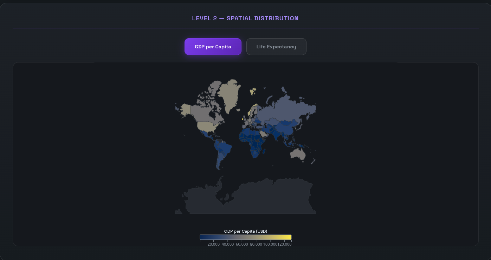

# Data Visualization Project

## Introduction

The main motivation throughout the project for me was the deadline but the idea behind the data was the geopolitical situation of the world. The way GDP of a country affects the population and the life expectancy and vice-versa. The overall idea behind the project is allow users to see real world relation between the three artributes.

## Data Used  
All the data being used was **https://ourworldindata.org/search** and all the data and the code used to filter the data being used by the website are under the folder called "data" making it very easy to find, and it is a simple CSV. 

## Design Process

My design process started with an idea behind how the website should, and the idea behind the color of the graph but as the number of graph and as the levels increased, I leaned more towards Cursor to help me out because of my lack of creative ability combined with me being colorblind, Cursor was taking the lead with the UI design. 

## Findings
The overall idea behind this project is to see if GDP affects life expentancy and how the two are related. The other dataset I have taken into account is population, because I have been told that GDP is affected by population but the idea behind the website is to show how. 

### Level 1

## AI usage

The way I used AI was for the actual design of the website (CSS and HTML) because I am not that creative and have absolute lack of knowledge about colurs (I tried but I cannot learn). I also used AI for understanding JS error that I got throughout the my working, which ranged a simple 404 error (which is simple working with many files, I was uanble to locate the eaact cause  but cursor could point exactly which line I need to look at ) to a something a little bit more complex. One of the main feature AI was used for the brushing and the highlighing in level 2 since I could not get it working across code and there was always seemed error out, I procastinated on the last two levels a lot so I decided to let cursor handle that feature.

Another way I used AI throughout the project, is give it an assignment.txt which I then use to grade and check if there is anything missing from the requirement which then pointed out that I need a third attribute for level 3, so I added population with it's help. The tooltips was modified a little for design by the AI because the tooltip I made did looked out of place. Throughout the project timeline (however short )Cursor was essentially used a team member for me instead of a helper because I was learning JS as I went through the project because my knowledge abt JS was more focused on backend and systems and not with d3.

The model used in Cursor was with Opus and GPT-5.1 reasoning models.
