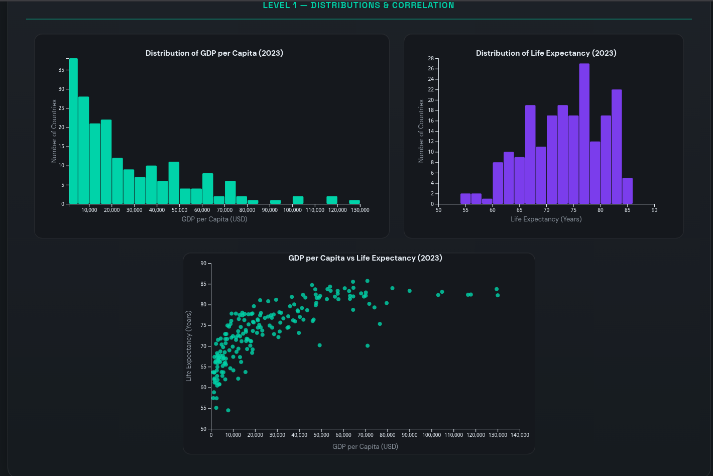
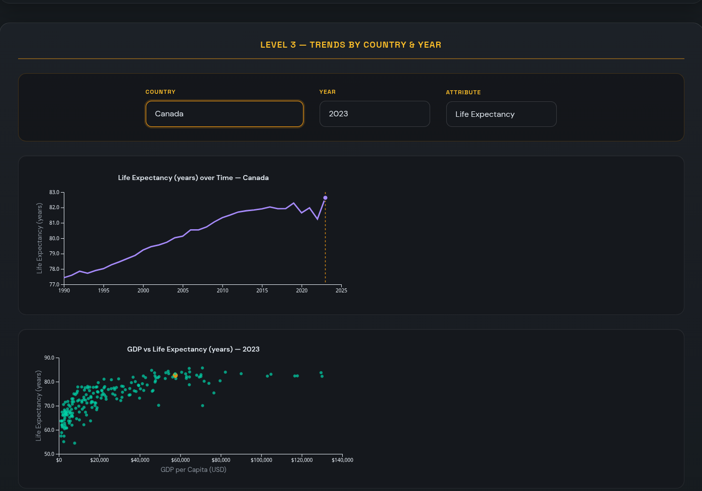

# Data Visualization Project

## Introduction

This project explores how a country’s economic output and demographics relate to quality of life. In particular, it focuses on the relationship between GDP per capita, life expectancy, and population across countries and over time. The goal is to give a first‑time viewer an interactive way to see real‑world patterns in these indicators: which regions are wealthier and healthier, how population relates to GDP, and how these relationships have evolved over time.

Through a sequence of three visualization “levels”, the application lets users move from simple distributions, to a global geographic view, and finally to detailed temporal trends for individual countries.

## Data

All datasets come from [Our World in Data](https://ourworldindata.org/). The CSV files and any preprocessing scripts are stored in the `data` folder of this repository.

The main attributes used are:

- **GDP per capita** (inflation‑adjusted, by country and year)  
- **Life expectancy at birth** (years, by country and year)  
- **Population** (total population, by country and year)  

From the original Our World in Data downloads, I filtered the columns down to just the variables needed for this project and saved them as simple CSVs that can be loaded directly into D3. The data is cleaned so that each row corresponds to a country‑year with consistent country codes.

You can find the original sources and documentation by searching for “GDP”, “life expectancy”, and “population” datasets on the Our World in Data website.

## Sketches and Design

My initial design process started with rough ideas about how I wanted the interface and color scheme to look. I sketched out:

- **Level 1**: two histograms and one scatterplot shown together to compare distributions and pairwise relationships.  
- **Level 2**: a choropleth world map with interactions (hovering and brushing) that could highlight countries and connect to other views.  
- **Level 3**: a trends view showing how indicators change over time for selected countries.

Because I am colorblind and not very confident in visual design, I relied heavily on AI (through Cursor) to iterate on color palettes, spacing, and typography. I treated the sketches as rough layouts and then used AI to refine them into a more polished and accessible UI while keeping the overall structure from my original ideas.

## Visualization Components and Interaction

The project is organized into three main levels (plus supporting views):

### Level 1: Distributions and Correlations

  

Level 1 presents three coordinated plots for a single year:

- **Histogram of GDP per capita**: shows how economic output per person is distributed across countries.  
- **Histogram of life expectancy**: shows the distribution of life expectancy across countries.  
- **Scatterplot of GDP per capita vs. life expectancy**: each point represents a country, with its position determined by GDP (x‑axis) and life expectancy (y‑axis).

By comparing the two histograms to the scatterplot, users can see that the relationship between GDP and life expectancy is not just random: wealthier countries tend to have higher life expectancy, and the scatterplot makes this relationship visually obvious. Tooltips and hover interactions (where implemented) allow users to inspect specific countries.

### Level 2: Choropleth Map

  

Level 2 moves to a **world choropleth map**. Each country is colored according to one of the variables (for example, GDP per capita or life expectancy). This view lets users see geographic patterns: which regions are consistently high or low, and how neighboring countries compare.

Interactions in this level include:

- **Hover tooltips** showing the country name and current values of the relevant variables.  
- **Brushing / highlighting**: selecting or hovering over a country can highlight it and, where connected, link back to the Level 1 scatterplot or forward to Level 3 so users can follow the same country across views.

This level emphasizes spatial patterns that are not obvious in purely statistical plots.

### Level 3: Trends Over Time

  

Level 3 is a **trends view** focusing on how indicators change over time for one or more countries. Users can select a country (for example, from the map or a dropdown), and see:

- A line chart of **GDP per capita over time**.  
- A line chart of **life expectancy over time**.  
- A way to incorporate **population** as a third attribute (for example, via color, line thickness, point size, or a separate panel).

Tooltips on the lines show exact values by year, which makes it easy to see whether improvements in GDP are followed by improvements in life expectancy, and how population growth might be related.

Together, the three levels form a narrative: distribution & correlation (Level 1), spatial variation (Level 2), and temporal evolution (Level 3).

## Findings

Using the application, several findings emerge:

- **GDP and life expectancy are positively related**: In the scatterplot in Level 1, there is a clear upward trend—countries with higher GDP per capita almost always have higher life expectancy.  
- **Diminishing returns**: At very high levels of GDP per capita, increases in GDP are associated with smaller gains in life expectancy, suggesting diminishing returns.  
- **Regional patterns**: The choropleth map in Level 2 shows that regions such as Western Europe, North America, and parts of East Asia tend to have both high GDP per capita and high life expectancy, while many countries in sub‑Saharan Africa are low on both dimensions.  
- **Population context**: When incorporating population in Level 3, large‑population countries (such as India and China) stand out. Tracking their trajectories over time shows major improvements in both GDP per capita and life expectancy, which carry large implications because of their population size.  
- **Temporal trends**: The trends view shows that for many countries, life expectancy improves steadily even when GDP per capita grows in fits and starts, but long‑term economic growth is typically associated with substantial health improvements.

These findings illustrate how economic development, population, and health outcomes are intertwined, and they highlight cross‑country inequalities that may not be obvious from single numbers.

## Implementation and Process

The source code is available in this repository, and (if applicable) the live version of the application is hosted at:  
https://viz-project-beta.vercel.app/

## Challenges and Future Work

This project involved several challenges:

- **Learning D3.js and debugging interactions**: My background with JavaScript was more on the backend/systems side, so building interactive visualizations required learning D3’s data binding, scales, and event handling from scratch. Features like brushing and cross‑highlighting across levels were especially tricky to implement without breaking other parts of the code.  
- **Design and accessibility**: As someone who is colorblind, choosing effective and accessible color palettes was difficult. I iterated many times on color schemes to keep the visualizations readable for myself and for other users.  
- **Data complexity**: Handling multiple indicators and years, while keeping the interface understandable for first‑time users, required simplifying some interactions and choosing which aspects to emphasize.

For future work, I would like to:

- Add more indicators (e.g., CO₂ emissions, education, income inequality) and allow users to choose which metrics to compare.  
- Improve linked interactions between levels so that selecting a country in one view instantly updates all other views.  
- Make the layout fully responsive and mobile‑friendly.  
- Add more advanced filtering (by region, income group, or time range) and annotation features to highlight interesting stories in the data.

## Use of AI and Collaboration

AI played a significant role in my workflow for this project:

- **UI and design assistance**: I used AI (via Cursor, with models including Anthropic Opus and GPT‑5.1‑class reasoning models) to help design the HTML and CSS. Because I have difficulty with colors, AI suggested color palettes, spacing, and layout ideas that I then adjusted to fit the data and accessibility needs.  
- **Debugging and learning**: Throughout development, I used AI to help understand and fix JavaScript and D3 errors—from simple issues like 404s due to incorrect file paths, to more complex problems in event handling and brushing logic. AI explanations were especially helpful while I was still learning D3’s mental model.  
- **Feature implementation**: One of the main areas where AI directly impacted the code was the brushing and highlighting in Level 2. I had trouble making brushing work consistently and propagate across views, so I asked AI for help in structuring the code and fixing subtle bugs.  
- **Requirements checking and documentation**: I also used AI to read the assignment description (from `assignment.txt`) and check whether my current project covered all required components. This led to, for example, adding population as a third attribute in Level 3 and refining tooltips so they fit the visual style better. AI also assisted in editing this written documentation for clarity and completeness.
